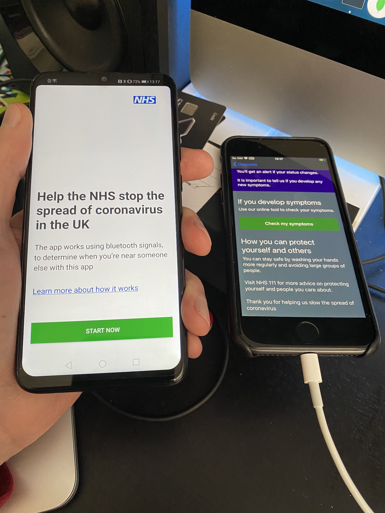
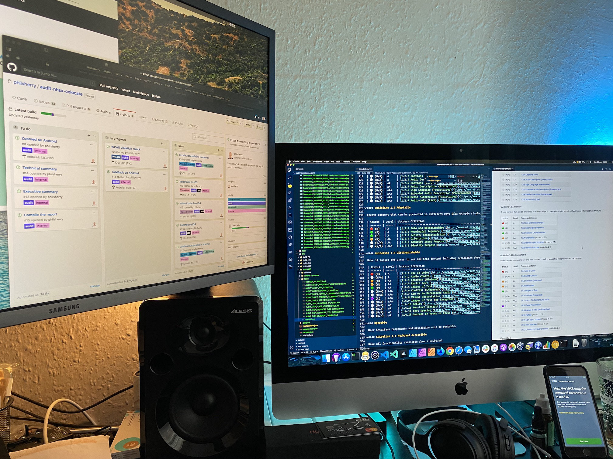
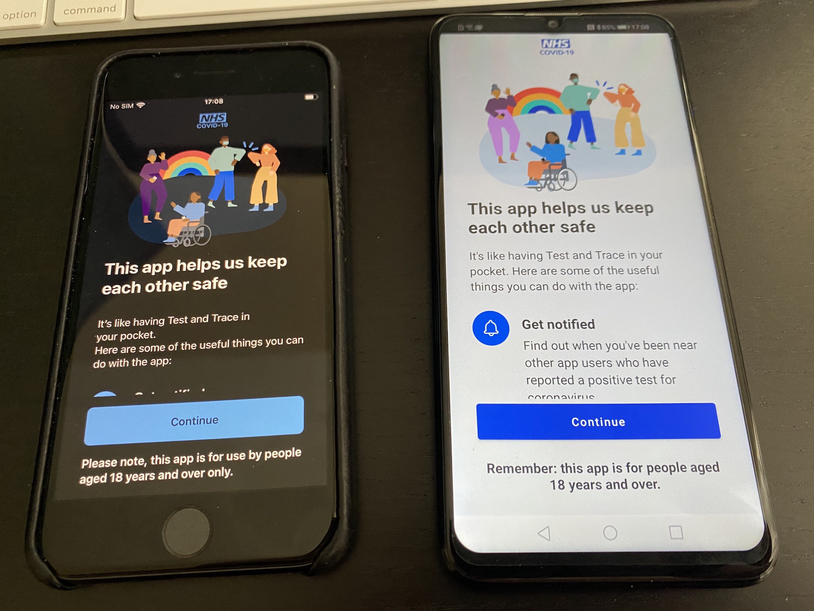
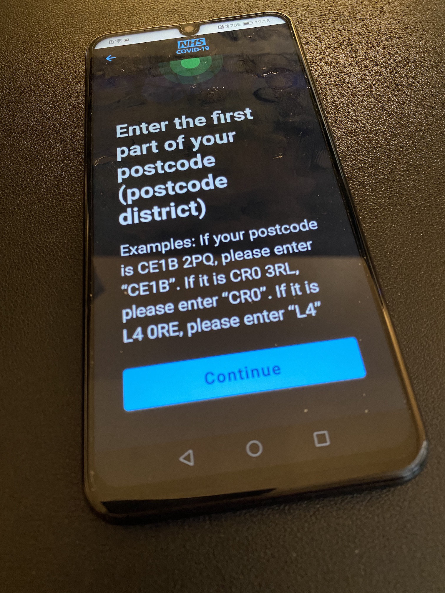

# Making the NHS Track & Trace app accessible for everyone

Due to its high importance, the NHS Track and Track app had to be absolutely 100% accessible by everybody — whether visually-impaired or fully blind; or by people who can only speak commands to their phone.

As well as making sure the app was WCAG 2.1 AA compliant, we also made sure it was completely usable. That meant testing it in many scenarios, with all manner of assistive technology on iOS and Android. We tested it with device-native screen readers (VoiceOver and TalkBack), voice activation (Voice Control and Voice Access), and all of the built-in settings that users can alter to make the device more comfortable for their situation; screen magnifiers, inverted colours, etc.

We also worked with the team who built the QR Code service to make sure that was compliant. We’ve been all over this to make sure everyone gets the best out of it.

Please do your part and download the app today.

Google Play Store: <https://play.google.com/store/apps/details?id=uk.nhs.covid19.production>

Apple App Store: <https://apps.apple.com/gb/app/nhs-covid-19/id1520427663>

----

