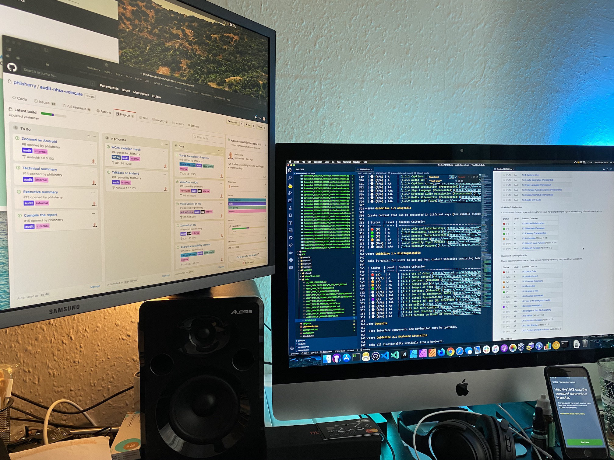

# Slides as text

This is as near as I can replicate the content of each slide with text, along with an exact copy of the contents from the presenter notes from each slide.

I’ve included images for completion, along with the alternative text used in the slides. I built the diagrams in Keynote, so, hmm…

## Slide 1: Accessibility Labs

Accessibility Labs

The rooms, not the dogs. No dogs here.

Phil Sherry, January 2023

### Notes

👋 Hello, if you’re reading along in the presenter notes.

I generally try to write my script for the presentation in here, so that anyone who isn’t present on the day can still get some benefit out of the slides.

I’m also dynamically-disabled and cognitively-impaired, so it’s a good safety net for me in case I’m not doing too good on the day—I can just read my script out.

Let’s get into it…

## Slide 2: Agenda

- Accessibility Lab setup
- Getting buy-in from teams
- In-house auditing
- New auditing system
- Financial benefits
- HMRC && NHS during lockdown
- Questions

### Notes

While this talk is primarily about setting up an accessibility lab, I’ll also be covering a bit about some other things that the existence of the Lab led on to.

Things such as educating teams and auditing processes, plus how we used all of the above during lockdown.

✋ Questions at the end, please, otherwise my brain might stall.

## Slide 3: Accessibility Lab setup

### Notes

Okay, the main event—setting up the Lab.

Tip #1: find the right person to deal with; someone who ‘gets it’ and will back you, but is also in a high enough position to back you.

I had many, many, many conversations with the Ops team at HMRC to find the right ear. (Mark was a lovely man, but unfortunately he died a couple of years later. RIP.)

We found an unused room (rare), got Ops to bless us with a budget and give us the go-ahead.

That was two of the main things ticked off the list. “Wait… what list?”

## Slide 4: Accessibility Lab shopping list

| Essential | Devices                                   | Licenses                              | Extras                                  |
| --------- | ----------------------------------------- | ------------------------------------- | --------------------------------------- |
| Room      | Windows & macOS desktops and (or) laptops | "JAWS & ZoomText (or both as Fusion)" | Whiteboard                              |
| Budget    | Android & iOS mobile devices              | Dragon NaturallySpeaking              | Big TV for presenting                   |
| Devices   | Bluetooth Switches                        | Read&Write                            | Posters!                                |
| Licenses  | "Sip’n’puff (Multi-user hygiene?)"        | NVDA (free)                           | "Empathy Lab? Simulator specs & gloves" |

### Notes

Tip #2: the main list to consider is this: Room, Budget, Devices, Licenses. Work on splitting that up however you can, but that’s what you need to figure out.

Are you repurposing old gear, or buying everything in new? Will you be allowing for [craptop testing](https://css-tricks.com/test-your-product-on-a-crappy-laptop/) as well?

Tip #3: You should—not everyone has brand new shiny devices. Old hardware runs older software, so allow for that, too.

Have plenty of laminated printouts for the common keyboard shortcuts for each screen reader, and gestures for mobile devices—visitors won’t just ‘know’ this stuff.

## Slide 5: The room

- Spacious
- Home Office design posters
- Table for teams to gather
- Lockable storage
- Whiteboard wall
- 55-inch TV for presenting
- Devices on HMRC network

### Notes

This is the only photo I have of the room, from a shit angle, with no gear on show. :(  [Home Office Posters](https://github.com/UKHomeOffice/posters)

The business end is to the left, out of shot, where the desktop computers are setup along the back wall. The wall to the right is one big whiteboard wall.

Lockable cupboard in the far corner, full of mobile devices and other stuff. When you book the room, this gets unlocked and you are responsible for the contents until it’s locked at the end of your session.

Okay, so you have your fancy new room, now what?

## Slide 6: Getting buy-in from teams

### Notes

How are your teams currently working? You need to identify patterns and figure out where this new Lab is going to fit in to the workflow.

Where are the weak points? Are there parts of the process where cash is going up in flames? 🔥

Here’s what the HMRC process boiled down to when I first looked at it…

## Slide 7: Old workflow

Things would come out of research and into development, then off to DAC for an accessibility audit. Then the team would fix the issues DAC had raised, before sending back the service for a re-audit. This cycle continued too many times, with some teams, before going to GDS for assessment.

### Notes

DAC: [Digital Accessibility Centre](https://digitalaccessibilitycentre.org/), near Swansea in South Wales. At ~£5k/service, this was both costly and time consuming. Some teams would fail as many as 5 times.

GDS: [Government Digital Services](https://www.gov.uk/service-manual/service-assessments/how-service-assessments-work), assessment was far from guaranteed with this version.

Notice no mention of testing here, as the QA department never really did accessibility testing at all.

So, how to approach inserting a new step into this process with teams?

## Slide 8: The buy-in

- One team at a time
- I’d drive the session as The User
- They’d watch me struggle
- They wrote down pain points
- I’d compare with my list
- They’d have a little cry
- I’d remind myself why I’m sober…

### Notes

You don’t want the new room to be a CHORE for people to have to work around, so you first need them to appreciate the BENEFIT that it’s bringing.

Get them in there, one team at a time and be The User for their product.

Ask them what it is that you’re supposed to be achieving during the session and then set out to do it… but not looking at the screen with the speakers cranked for the screen reader to guide you.

They’ll all the looking at the big screen TV and their collective cringe will fill the room in seconds as everything on the screen falls over, self-immolates, and then explodes.

## Slide 9: Quote

> “Honestly? I wanted to get up and walk out—it was brutal.”

A developer’s first time witnessing their work through a screen reader.

### Notes

Because I’d already audited so many services by now, I knew where most of the pain points where.

To drive a point home, I might have liberally applied salt to those open wounds and then had various team members unwittingly pour vinegar on them.

People always left those sessions knowing exactly what they needed to fix, and why.

After every team had gone through this process and were fully on board, we made another big change…

## Slide 10: Next step

We moved most auditing in-house

### Notes

Everything but the behemoth services, such as Tax Credits, we moved in-house.

This allowed us a few benefits, but time constraints and budgets were the obvious winners. The next benefits were communication and education.

Because we expanded the accessibility team to cope with the auditing, we also had the opportunity to communicate directly with teams over Slack during service development.

This meant we could also pinpoint their most common failings and educate them on those specific things.

Which led us here…

## Slide 11: New workflow

Rather than a cyclical flow of development and auditing, each discipline worked towards accessibility in every sprint, and tested as a team at the end of a sprint.

### Notes

New version moved teams to using Definitions of Ready & Done with focus on accessibility. Teams we now actively using the Lab to test their services and new features.

User Researchers were making a much bigger point of accessibility and access needs groups.

Developers understood why they were making things accessible, and how to test they were doing it properly.

QA were actively hands-on with testing devices, rather than only writing automated tests.

In-house Accessibility Team replaced the costly and time-consuming DAC process, as well as advising throughout.

- <https://github.com/hmrc/accessibility>
- <https://hmrc.github.io/accessibility-empathy-hub/>
- <https://hmrc.github.io/gaad/>

## Slide 12: In-house auditing

### Notes

When I first came upon the accessibility team, the auditing process was a bit… lacking?

The end result was okay(-ish), but getting there was awkward and opaque to service teams.

It was user-hostile and in need of an overhaul.

## Slide 13: Old process

### Notes

It was basically a system of emails and Google Docs, with reports stored on Google Drive.

Because of how my brain works, I felt the need to fix that.

## Slide 14: New auditing system

### Notes

I started thinking about what we’d need from an auditing system:

Access from anywhere, transparency for service teams, easy to use, accessible, and so on.

HMRC already used GitHub, and GitHub had Projects, so I looked into that.

What I came up with was this…

## Slide 15: GitHub Projects

### Notes

GitHub Projects is just a KanBan-style layout for your Issues, so these are just regular GitHub Issues with regular Labels.

The main addition is the Issue templates for all the tasks which allow anyone to pick up an issue and read what they need to do.

Emoji for recognition in browser tabs and for visual people who scan the board.

All raised issues go into the 4th column for fixing. There’s a 5th column—Fixed—for the retest.

Results from this go towards the accessibility statement, and a report is generated.

## Slide 16: Audit report

Report contents:
1. Executive summary
2. Technical summary
3. Violations in order
4. WCAG 2.1 AA results in full
5. User stories followed

### Notes

The final report has summaries in stakeholder-speak, developer-grunt, and then lists all of the violations with links through to their individual Issues—these can be referenced in Pull Requests.

We follow that up with two appendices:

The WCAG 2.1 AA results in full, should they want to use it to inform their accessibility statement.

The user stories that we followed to get these results.

They provided the user stories, but feeding them back into the report is handy for anyone working on fixing the issues that we raised.

<https://accessibility.blog.gov.uk/2020/12/01/bringing-accessibility-audits-in-house/>

## Slide 17: Financial benefits

### Notes

A side-effect from all of this work? Financial benefits. All of these services are no longer going to an external company at ~£5k/audit.

That all adds up.

Over the first year, we think it added up to…

## Slide 18: Annual saving

~£250k

Estimated minimum amount saved in the first year.

### Notes

That’s tax-payer money, yo! 💸

You can thank me later.

So, as well as educating our developers, we also saved a few quid.

This system came in VERY handy when lockdown hit, by the way.

## Slide 19: HMRC && NHS during lockdown

### Notes

I’d only had it place for about 4 or 5 weeks before the country was in full lockdown mode.

That turned out to be amazingly timely.

- <https://civilservice.blog.gov.uk/2021/05/25/how-hmrc-and-hmt-delivered-coronavirus-support-schemes-together/>
- <https://www.aatcomment.org.uk/content-collections/women-in-finance/the-human-story-behind-hmrcs-delivery-of-coronavirus-schemes/>

## Slide 20: HMRC

- Eat Out to Help Out
- Coronavirus Job Support Scheme
- Coronavirus Job Retention Scheme
- Coronavirus Statutory Sick Pay Scheme
- Coronavirus Helpdesk
- Self Employment Income Support Scheme

### Notes

These are just some of the HMRC services that I worked on throughout the lockdown period. VERY tiring work.

Nothing went live without coming through my team first and getting the green light.

To speed up that process, we worked on each team fixing bugs are the developers made them, or advising them about areas to avoid if we could see things coming.

We then audited these using the system I showed earlier. The previous “email + Google Docs” method stood no chance against this onslaught.

I also worked on some NHS stuff during lockdown…

## Slide 21: NHS service

NHS COVID-19 Poster Generator

### Notes

Another service I was working on during the evenings, after a full day of HMRC COVID services.
I’m sure some of you in the UK used these posters to scan into locations at some point.
If so, you used the NHS Test and Trace app to do so… which I also worked on during the evenings.

## Slide 22: NHS app

Test and Trace COVID-19 app

### Notes

I used the exact same system to audit the app as I’d just written for auditing the services at HMRC.

## Slide 23: Device testing

### Notes

Large text and inverted colours on Android version of the NHS Test and Trace app. L4 0RE is the postcode for Liverpool FC’s stadium in Anfield—yes, that was me who put that in there. ⚽️ 🚩
Version 1 of the Test and Trace app on Android and iPhone. Testing dark and light modes.
Version 3 of the Test and Trace app on Android and iPhone. Testing dark and light modes.

## Slide 24: End

Questions?

`@philsherry`
